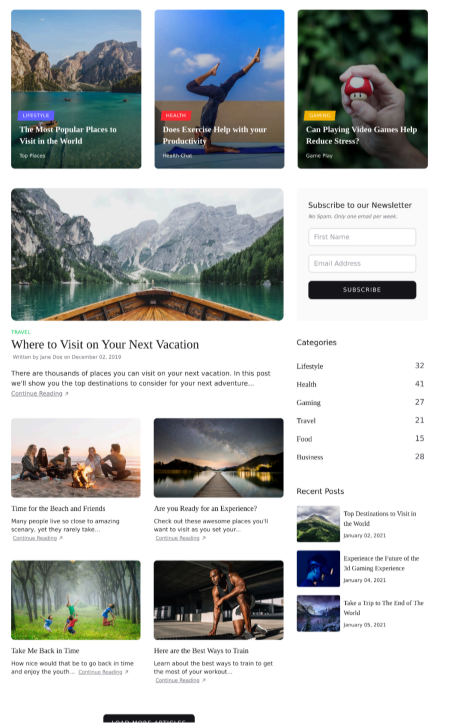
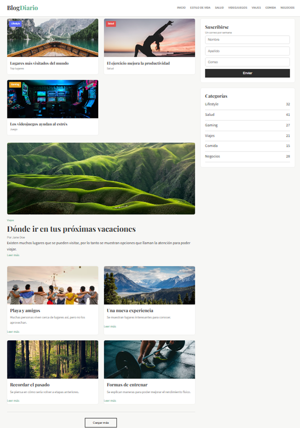

# Tarea 1 — Clon de Sección de Sitio Web

**Estudiante:** Bryan Josué Calderón Espinoza
**Curso:** Multimedios
**Sitio clonado:** Blog estilo revista con sidebar

## Descripción

Se realiza el clon de la sección principal de un blog tipo revista, tal que se obtiene una estructura similar a la de sitios reales de contenido. Así mismo, se implementa un diseño que incluye tarjetas, un artículo principal y una barra lateral, como para poder demostrar el uso correcto de HTML semántico y CSS.

El proyecto se desarrolla únicamente con HTML y CSS puro, es que no se hace uso de frameworks ni de JavaScript, para así mantener un enfoque básico pero funcional en la construcción del sitio.

## Estructura de archivos

tarea1-clon-web/
└── src/
    ├── index.html
    ├── styles.css
    ├── README.md
    └── img/
        ├── imagen1.jpg
        ├── imagen2.jpg
        ├── imagen3.jpg
        ├── imagen4.jpg
        ├── imagen5.jpg
        ├── imagen6.jpg
        ├── imagen7.jpg
        └── imagen8.jpg

## Requisitos cumplidos

### HTML

* Se utiliza la estructura completa del documento HTML
* Se aplican etiquetas semánticas como: `<header>`, `<nav>`, `<main>`, `<section>`, `<aside>`, `<article>`, `<footer>`
* Se incorporan imágenes con atributo `alt` descriptivo

### CSS

* Se utiliza archivo externo `styles.css`
* Se definen colores mediante variables CSS (`--primario`, `--acento`, etc.)
* Se aplica tipografía externa con Google Fonts
* Se utilizan distintos tipos de selectores:

  * Elemento (`body`, `img`, `input`)
  * Clase (`.card`, `.sidebar`, `.widget`)
  * Pseudo-selectores (`:hover`, `:focus`)
* Se incluye comentario que explica el uso de la cascada y la especificidad en los inputs

### Formulario y multimedia

* Formulario con 3 campos (nombre, apellido y correo)
* Botón de envío funcional
* Uso de múltiples imágenes locales con texto alternativo

## Capturas

### Sitio original

### Resultado del clon

## Decisiones de diseño

Se utiliza CSS Grid en el layout principal, tal que se logra dividir el contenido en una sección de artículos y una barra lateral. Así mismo, se definen variables CSS para mantener consistencia en los colores y facilitar cambios.

Se emplea la fuente Playfair Display para los títulos y Source Sans 3 para el contenido, lo cual permite una mejor lectura. Es que la combinación de estas tipografías genera un estilo similar al de blogs profesionales.

Además, se aplican efectos como hover en enlaces y botones, para así mejorar la interacción del usuario.
